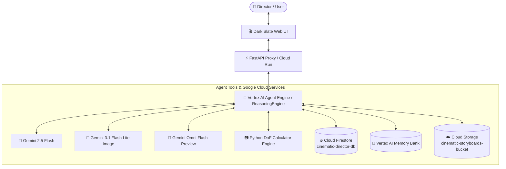

# 🎬 Cinematic Director & Storyboard Creator

[](https://cloud.google.com/vertex-ai)
[](https://github.com/google/adk)
[](https://www.python.org/)
[](https://cloud.google.com/run)
[](LICENSE)

An intelligent, autonomous AI Movie Director agent built with **Google ADK (Agent Development Kit)**. The agent assists filmmakers, directors, and cinematographers in scene planning, camera rig calculations, visual 16:9 storyboard frame generation, animated video preview creation, and shot list curation.


---

## 🌐 Live Application Deployment

- **Cloud Run Service URL**: [https://cinematic-director-frontend-419786518315.us-east1.run.app](https://cinematic-director-frontend-419786518315.us-east1.run.app)
- **Vertex AI Agent Engine Resource**: `projects/419786518315/locations/us-east1/reasoningEngines/3088125741167017984`

---

## 📊 System Architecture



---

## 🚀 Key Features & Implemented Capabilities

This repository implements the following production features wired directly to Google Cloud infrastructure:

### 1. 🎬 Storyboard Shot Management (Cloud Firestore)
- **Persistent Database Storage**: Saves, retrieves, and lists shot compositions, camera angles, and movement notes in Google Cloud Firestore (`cinematic-director-db` database, `storyboards` collection).
- **Tools**: `list_storyboard_shots`, `get_storyboard_shot`, `save_storyboard_shot`.

### 2. 📷 Optical Depth of Field (DoF) Calculator
- **Mathematical Optics Solver**: Calculates hyperfocal distance, near limit, far limit, and total depth of field given lens focal length (mm), aperture (f-stop), subject distance (feet), and camera sensor format (Full Frame, Super 35, APS-C).
- **Tool**: `calculate_depth_of_field`.

### 3. 🎨 Visual 16:9 Storyboard Image Generation
- **Image Model**: Uses Google Vertex AI `gemini-3.1-flash-lite-image` to generate 16:9 cinematic storyboard concept frames from detailed textual scene prompts.
- **Tool**: `generate_storyboard_image`.

### 4. 🎥 Animated Video Shot Generation
- **Omni Model**: Uses Google Vertex AI `gemini-omni-flash-preview` in the `global` location to generate animated 16:9 video storyboard clips.
- **Tool**: `generate_cinematic_video`.

### 5. ☁️ Google Cloud Storage & Playground Artifacts Integration
- **Direct Byte Streaming**: Streams generated image and video bytes directly to a public Cloud Storage bucket (`cinematic-storyboards-<project_id>`) without writing temporary local files.
- **Playground Artifacts Panel**: Registers generated media with `tool_context.save_artifact` so they appear directly in the ADK Playground Artifacts panel.

### 6. 🧠 Vertex AI Memory Bank
- **Session Preference Retention**: Automatically records and retains director style preferences (e.g., *Denis Villeneuve*, *Christopher Nolan*, *Wes Anderson*), camera rig configurations, and plot notes across sessions using `PreloadMemoryTool` and `generate_memories_callback`.

### 7. 🃏 A2UI Rich Card Rendering (v0.8 Catalog)
- **Structured UI Surfaces**: Generates structured A2UI JSON components (`Card`, `Column`, `Row`, `Text`, `Image`) rendered safely by the custom FastAPI/HTML/CSS web frontend.

---

## 🔌 Agent Tools API Reference

| Tool Name | Parameters | Description | Output |
| :--- | :--- | :--- | :--- |
| `list_storyboard_shots` | `limit: int = 20` | Fetches saved scene shots from Cloud Firestore | JSON list of shots |
| `get_storyboard_shot` | `shot_id: str` | Retrieves a specific storyboard shot by ID | Shot details object |
| `save_storyboard_shot` | `scene_number`, `shot_type`, `camera_angle`, `description` | Saves a new shot composition to Cloud Firestore | Confirmation message & Shot ID |
| `calculate_depth_of_field` | `focal_length_mm`, `aperture_f_number`, `subject_distance_ft`, `sensor_format` | Computes optical DoF, hyperfocal distance & focus limits | Formatted optical report |
| `search_cinematic_references` | `query` | Searches film metadata and director camera techniques | Cinematic references list |
| `generate_storyboard_image` | `prompt`, `tool_context` | Generates 16:9 storyboard frame via Vertex AI image model | Public GCS HTTPS URL & Artifact |
| `generate_cinematic_video` | `prompt`, `tool_context` | Generates 16:9 animated video clip via `gemini-omni-flash-preview` | Public GCS HTTPS URL & Artifact |

---

## 🛠️ Feature Status Matrix

| Feature | Status | Technology / Service |
| :--- | :---: | :--- |
| Storyboard Shot Management | ✅ Implemented | Cloud Firestore (`cinematic-director-db`) |
| Depth of Field Calculator | ✅ Implemented | Python Math Optics Engine |
| Visual Storyboard Frame Generation | ✅ Implemented | Vertex AI (`gemini-3.1-flash-lite-image`) |
| Animated Video Shot Preview Generation | ✅ Implemented | Vertex AI (`gemini-omni-flash-preview`) |
| Media Storage & URL Generation | ✅ Implemented | Google Cloud Storage |
| Long-term Memory & Director Style Memory | ✅ Implemented | Vertex AI Agent Engine Memory Bank |
| A2UI Card Response Surface | ✅ Implemented | A2UI Schema Manager v0.8 & FastAPI Proxy |
| Full-length Multimodal Audio Score Rendering | ⏳ *Planned, not yet implemented* | - |

---

## 🏗️ Architecture & Google Cloud Services

- **Agent Runtime**: Google Vertex AI Agent Engine (`ReasoningEngine`)
- **Language Models**: Google Gemini 2.5 Flash (Core Agent Reasoning), Gemini 3.1 Flash Lite Image (Image Gen), Gemini Omni Flash Preview (Video Gen)
- **Database**: Google Cloud Firestore
- **Object Storage**: Google Cloud Storage (Public Bucket)
- **Frontend**: Custom FastAPI Proxy + Vanilla HTML5/CSS3 Web UI on Cloud Run

---

## 💻 Local Setup & Running Instructions

### Prerequisites
- Python 3.10+
- Google Cloud SDK (`gcloud`) authenticated to your GCP project
- `uv` package manager (`pip install uv`)

### 1. Environment Configuration
Set your GCP environment variables:
```bash
export GCP_PROJECT_ID="qwiklabs-gcp-03-ef01b95861de"
export GOOGLE_GENAI_USE_VERTEXAI="true"
export GOOGLE_CLOUD_LOCATION="us-east1"
```

### 2. Run the Agent CLI Locally
To run and test the agent interactively in your terminal:
```bash
agents-cli run
```

### 3. Run the Frontend Web App Locally
To start the FastAPI proxy and dark-themed director frontend web server:
```bash
cd frontend
export AGENT_ENGINE_RESOURCE_NAME="projects/419786518315/locations/us-east1/reasoningEngines/3088125741167017984"
export AGENT_DIRECTORY="app"
export PORT=8080

uv run python main.py
```
Open your browser to port `8080` to interact with the frontend interface.

---

## 🚀 Deployment Instructions

### Deploy Agent to Agent Runtime
Deploy the ADK agent to Vertex AI Agent Engine:
```bash
agents-cli deploy --project qwiklabs-gcp-03-ef01b95861de --no-confirm-project
```

### Deploy Frontend to Cloud Run
Deploy the web server frontend to Cloud Run:
```bash
gcloud run deploy cinematic-director-frontend \
  --source ./frontend \
  --project qwiklabs-gcp-03-ef01b95861de \
  --region us-east1 \
  --set-env-vars AGENT_ENGINE_RESOURCE_NAME="projects/419786518315/locations/us-east1/reasoningEngines/3088125741167017984",AGENT_DIRECTORY="app" \
  --allow-unauthenticated
```
